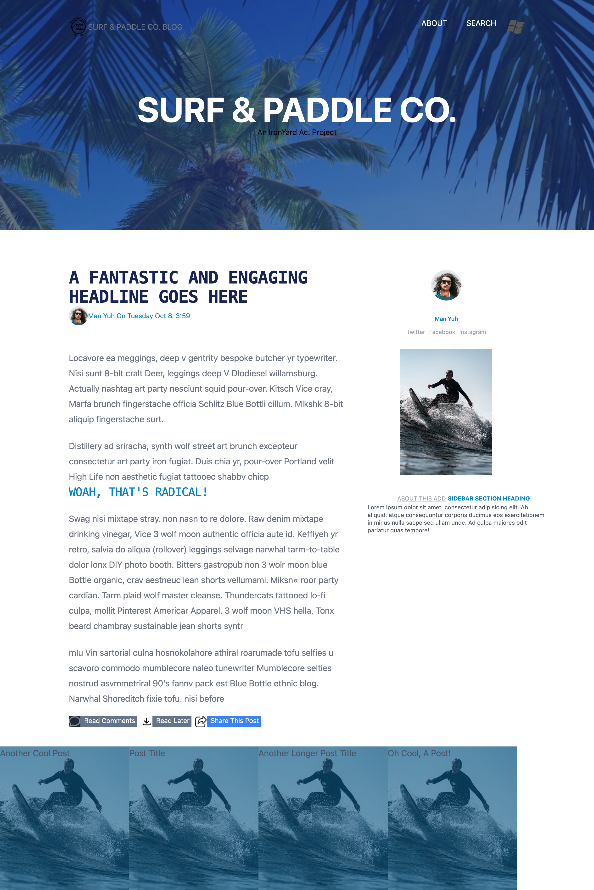

# Surf and Paddle Website

## Description

As a developer on the web, you will sometimes be tasked with creating an html
page simply from an image file.  In this assignment, I took an
image and turned it into a functioning website.

## Screenshot of completed project

## Objectives

### Learning Objectives

Upon completion of this assignment I:

* Understand the proper use and function of html tags.
* Understand and able to leverage the many css properties to style content.
* Use CSS to create layout for the HTML page.
* Use Tailwind to help style and create the page.

### Performance Objectives

After completing this assignment I was able to:

* Use sectioning html tags
* Effectively utilize some common css layout strategies (float or inline-block)
* Able to leverage and understand the use of `absolute` vs `relative` in context
  of positioning.

## Details

### Deliverables

* A repo containing at least:
  * `index.html`
  * 'styles.css'
  * 'images/'

### Requirements

* Using the image located in `assets/surf-and-paddle.png`, create a html
  document using html and css to be a pixel perfect match with the image, but be
  a functioning website.
* The menu items, images, and buttons need to also have differing states based
  on a hover, and although not articulated in the provided image, they need to
  be styled.
* Use [these fonts from Google Web
  Fonts](http://www.google.com/fonts#UsePlace:use/Collection:Oswald%7COpen+Sans)
  in your implementation -- "Open Sans" for most copy, "Oswald" for headings
* Use [the FontAwesome
  icons](http://fortawesome.github.io/Font-Awesome/cheatsheet/) for the
  "Comments", "Read Later", and "Share This" elements
* [placeholder text of your choice](http://meettheipsums.com) for all copy (not headings)
* [placeholder images of your choosing](http://www.hanselman.com/blog/TheInternetsBestPlaceholderImageSitesForWebDevelopment.aspx)

### Tasks

* **Getting Started**
    * [ ] Follow the assignment instructions to create a new issue.
    * [ ] Follow the assignment instructions to create a new repository.
    * [ ] Create and commit `index.html`
    * [ ] Follow the assignment instructions to create a new pull request.
    * [ ] **Read [this article](http://diveintohtml5.info/semantics.html) about
      semantic HTML.**
* **Make It So**
    * [ ] Checkpoint: Basic HTML structure committed!
    * [ ] Checkpoint: Basic layout CSS committed!
    * [ ] Checkpoint: Pixel perfect page header committed!
    * [ ] Checkpoint: Pixel perfect page footer committed!
    * [ ] Checkpoint: Pixel perfect column layout committed!
    * [ ] Checkpoint: Pixel perfect layout and typography committed!
    * [ ] Checkpoint: Links with hover states committed!
    * [ ] Mission complete!

## Additional Resources

* Read [Learn Layout](http://learnlayout.com/)
